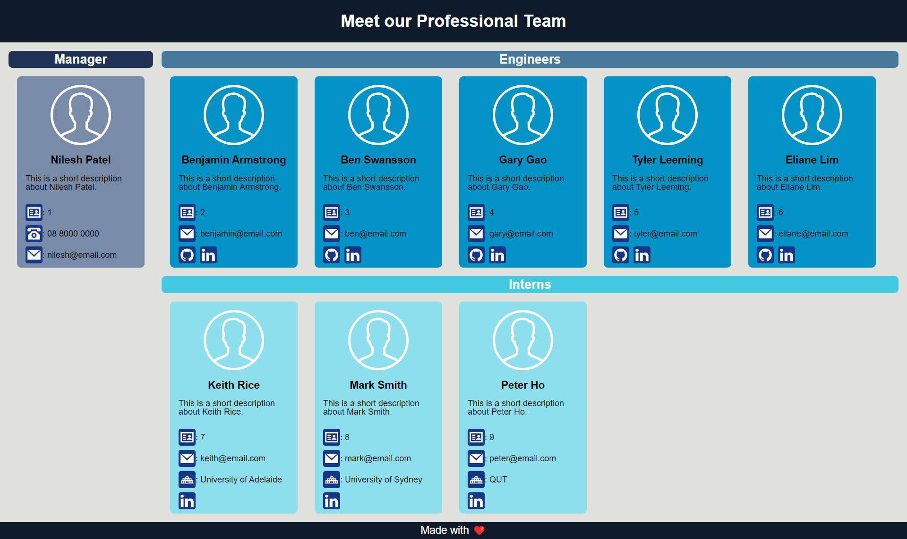

# Team Profile Generator


## Description
Command-line application that accepts user inputs and prompts information about team members to generate nicely formatted team roaster HTML file.

## Table of Contents
* [Usage](#usage)
* [Installation](#installation)
* [Tests](#tests)
* [Deployment](#deployment)
* [Screenshots](#screenshots)
* [License](#license)
* [Contribution](#contribution)
* [Questions](#questions)

## Usage

- When user starts the application, user is prompted to enter the team manager's name, short description about the manager, employee ID, email and office number.
- User is presented with a menu with option to add an engineer or an intern or to finish building the team.
- If user selects the engineer option, user is prompted to enter the engineer's name, short description about the engineer, employee ID, email, GitHub username and LinkedIn profile URL.
- If user selects the intern option, user is prompted to enter the intern's name, short description about the intern, employee ID, email, school name and LinkedIn profile URL.
- When user decides to finish building the team, user exits the application and nicely formatted HTML file is generated.
- When user clicks on an email address in HTML, user's default email program opens and populates the To field of the email with the email address clicked.
- When user clicks on GitHub logo for an engineer, GitHub profile of the engineer opens in new tab.
- When user clicks on LinkedIn logo for an engineer or an intern, LinkedIn profile of the engineer or the intern opens in new tab.

## Installation
To install necessary dependencies, run the following command:
```
npm install
```

## Tests
To run tests, run the following command:
```
npm test
```

## Deployment
Deployed webpage: https://nileshpatel83.github.io/Team-Profile-Generator

## Screenshots
The page resembles as following on desktop.



The page resembles as following on mobile.


## License
The project is licensed under: MIT.

## Contribution
Contact me

## Questions
If you have any questions about the repository, open an issue or contact me directly at hselin_83@yahoo.com. You can find more of my work at [NileshPatel83](https://github.com//NileshPatel83).
